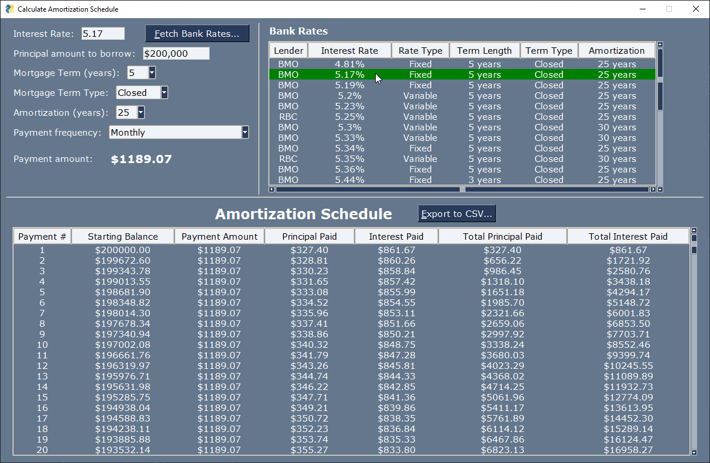

# Mortgage Amortization Schedule & Payment Calculator

### Video Demo:  
    URL TBD...

### Description:

This program has 4 main functions:

1. To retrieve & display **current interest rates** from (some) Canadian banks
2. To determine the **mortgage payment amount**
3. To calculate & display a complete **amortization schedule**
4. To **export** the amortization schedule as a CSV file

These features are implemented as a **graphical user interface** using [**PySimpleGUI**](https://www.pysimplegui.org/) library. Interest rates are retrieved from bank websites using [**Scrapy**](https://scrapy.org/) web scraping library.

The calculations update instantly when any relevant input value is changed.

The interest rate can be entered manually, as web-scraping is an optional feature. When **<u>F</u>etch Bank Rates** is clicked, the Bank Rates table is populated. When selecting any row from Bank Rates table, the interest rate field is updated, and the payment and amortization schedules are re-calculated.

When **<u>E</u>xport to CSV** is clicked, the user is prompted by a File Save dialog to select a path and file name. The amortization schedule is then saved to the specified file name.

### Program Structure:

The program consists of 2 python modules, and a test module:

| File                | Description |
| ------------------- | ----------- |
| **project.py**      | the main GUI and helper functions |
| **spiders.py**      | the web scraping spider module |
| **test_project.py** | test cases for the functions in project.py |

#### PyTest:

**test_project.py** module contains 9 tests to exercise the helper functions in project.py. Each function has a set of happy-path test cases, and "error" test cases (non-happy path). These are implemented with the [**PyTest**](https://docs.pytest.org/) testing framework.

### Design considerations:

#### PySimpleGUI

The [**PySimpleGUI**](https://www.pysimplegui.org/) library was chosen for it's ease of use and short learning curve. It comes with a huge number of examples provided by the community, which made it very easy to learn and create a simple GUI in a short time.

#### Scrapy

[**Scrapy**](https://scrapy.org/) library was chosen specifically because I wanted to learn about web-scraping. This is a powerful library and probably overkill for what's being accomplished here.  But was a good lesson in how to use it.